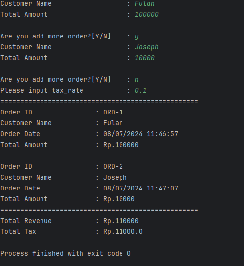

**DOCUMENTASI SINGKAT**
 
Program ini terbagi menjadi 3 file utama dengan tree
```
-python-task
    |   main.py
    |   order.py
    |   order_processor.py
    |   README.md

```
Keterangan:
1. File `main.py` adalah file yang digunakan untuk menjalankan program order dengan memasukan nama customer dan total maountnya, serta menampilkan hasil akhir dari programnya.
2. File `order.py` adalah file yang berisi _class Order_ di class ini saya menggunkan prinsip `encapsulation` untuk setiap atribute instancenya seperti pada attribute `order_id, customer_name, order_date, dan total_amount`.
3. File `order_processor.py` adalah file yang berisi _class OrderProcessor_ di class ini saya menggunakan prinsip `inheritance` untuk mengambil beberapa sifat dari _class Order_ kemudian saya memanfaatkan prinsip OOP `polymorphism` untuk melakukan overwrite fungsi `display_order` yang juga sama di _class Order_

Hasil Screen Shot Akhir dari program yang dijalankan



Author: Muhammad Khairunnas